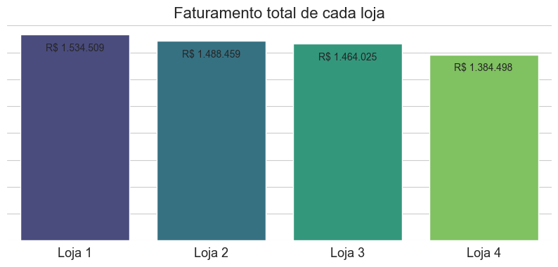

# Análise Comparativa de Lojas para tomada de decisão

> Análise exploratória de dados de quatro lojas para identificar a unidade com menor desempenho e recomendar sua venda, baseando a decisão em métricas de faturamento, avaliação de clientes e custos de frete.

<br>



---

## Sobre o Projeto

Em um cenário de otimização de recursos, uma empresa precisa decidir qual de suas quatro lojas deve ser vendida. Este projeto fornece uma análise de dados completa para apoiar essa decisão estratégica, transformando dados de vendas, avaliações e fretes em uma recomendação clara e baseada em evidências.

---

## 💡 A Recomendação Final

Após a análise detalhada dos dados, a recomendação é a venda da **Loja 1**. Os principais fatores que levaram a esta conclusão foram:

*   **Menor Faturamento:** Apresentou o menor faturamento total entre as quatro unidades.
*   **Pior Avaliação Média:** Possui a nota de avaliação mais baixa dada pelos clientes.
*   **Alto Custo de Frete:** Demonstrou um custo de frete proporcionalmente alto em relação às suas vendas.

O notebook detalha o passo a passo e os gráficos que sustentam esta recomendação.

---

## Tecnologias Utilizadas

- **Linguagem:** Python
- **Bibliotecas:** Pandas, Matplotlib, Seaborn
- **Ambiente:** Jupyter Notebook

---

## Como executar

```bash
# 1. Clone o repositório
git clone https://github.com/henry-mesquita/desafio-etl-alura.git

# 2. Navegue até o diretório
cd desafio-etl-alura

# 3. (Opcional, mas recomendado) Crie e ative um ambiente virtual
python -m venv venv
source venv/bin/activate # No Windows: venv\Scripts\activate

# 4. Instale as dependências
pip install -r requirements.txt

# 5. Inicie o Jupyter Notebook
jupyter notebook
```

Agora, basta abrir o challenge_alura.ipynb e executar as células.

---

## Autor
Desenvolvido por **Henry Mesquita**.

*Este projeto foi originalmente criado como parte do Challenge de Ciência de Dados da Oracle em conjunto com a Alura.*
